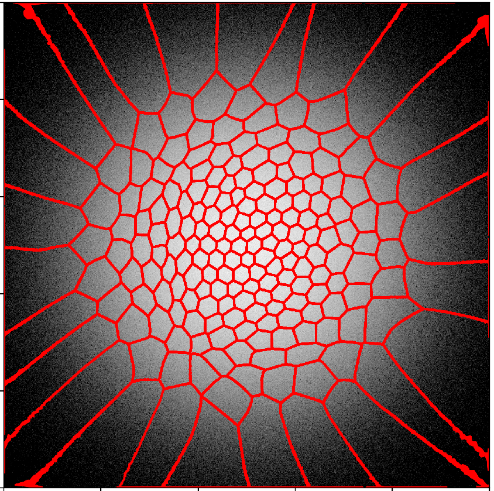
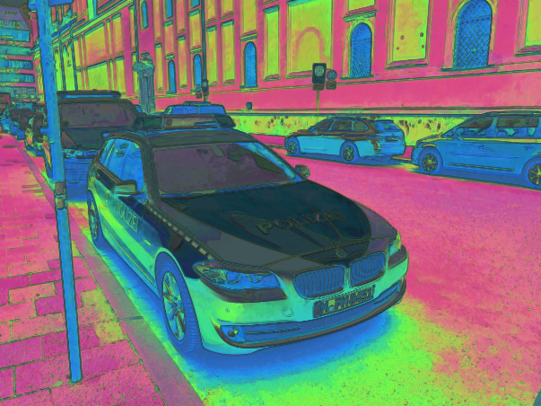

# Efficient Representation of Natural Image Patches

<p align="center">
  
  
</p>

This repository contains code to reproduce the main experiments from:

> **Efficient Representation of Natural Image Patches**  
> Cheng Guo – arXiv:2210.13004  
> https://arxiv.org/abs/2210.13004

Since 2011, I have been thinking about the following question in my spare time, mostly as an intellectual challenge and just for fun:

> **If you were an engineer tasked with designing the visual system of an organism, what would you do?**

This question is too big, so I worked one small step at a time and tried to see how far I could get. The current status of this decade-long journey is summarized in the note above.  
This repo provides a minimal, runnable implementation of the core ideas.


## Repository structure

- `two_pixel/` – Jupyter notebooks for the two‑pixel case analyzed in the paper. See `two_pixel/README.md`.
- `image_patch/` – code and scripts for training and analyzing the image-patch case in the paper. See `image_patch/README.md` for details.
- `requirement.txt` – Python dependencies for running the experiments and notebooks.


## Two directions I am looking for collaborators

There are two directions I would be very happy to find collaborators to work on.

### EvenCodeTokenizer

Goal: turn the IPU-based binary representation into a practical **image / video tokenizer** for downstream models (e.g., vision transformers, multimodal LLMs, robotics pipelines (VLAs)).

If you are interested in making the tokenizer more robust and benchmarking it, and you have access to GPUs, please email me.


### Comparison with real neural recordings

Goal: systematically compare the IPU’s binary population codes with **real neural data** from early visual areas (retina, LGN, V1, V2, etc.).

If you work with neural data (or have access to relevant datasets) and are interested in testing the theory against real recordings, please contact me.


## Citation

If you use this code or build on these ideas, please cite:

```bibtex
@misc{guo2024efficientrepresentationnaturalimage,
      title         = {Efficient Representation of Natural Image Patches},
      author        = {Cheng Guo},
      year          = {2024},
      eprint        = {2210.13004},
      archivePrefix = {arXiv},
      primaryClass  = {cs.CV},
      url           = {https://arxiv.org/abs/2210.13004},
}
```
